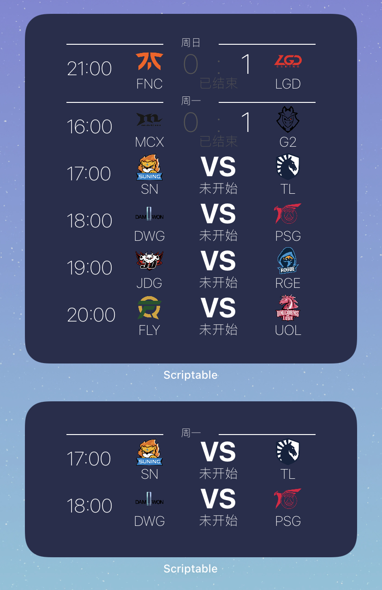

# iOS 14小组件

## 使用方法
### 安装scriptable
安装[scriptable测试版](https://testflight.apple.com/join/uN1vTqxk) 或 直接安装app store 中的[scriptable](https://apps.apple.com/cn/app/scriptable/id1405459188) .
> 这里建议安装测试版，因为测试版支持更多特性，且我的脚本一般是以测试版为基础编写的。

### 安装脚本
安装脚本有两种方法，自行选择：

方法1：在`scriptable`中新建脚本，然后将`scripts`文件夹下的js文件内容粘贴到脚本中。

方法2：在[Release页面](https://github.com/zkytech/iOS14-widgets-for-scriptable/releases)下载`.scriptable`安装脚本，然后用`scriptable`打开，选择`Add to my scripts`即可。

### 使用
1. 在桌面创建小组件 选择 `scriptable`

2. 编辑 小组件，点击`选取 script` 并选择前面导入的脚本。


## bilibili 最近更新番剧列表

### 效果预览


### 安装

下载[安装脚本](https://github.com/zkytech/iOS14-widgets-for-scriptable/releases/download/1.0.0/bilibili.scriptable)后，用`scriptable`打开

### 参数

小组件的parameter可以设置以下几个值

<table>
    <thead>
        <tr>
            <th>参数</th> <th>必填</th> <th>值/示例</th> <th>说明</th> 
        </tr>
    </thead>
    <tbody>
        <tr>
            <td rowspan="3">type</td> <td rowspan="3">否</td> <td>番剧/global/进口</td> <td>进口番剧</td>
        </tr>
        <tr>
            <td>国创/cn/国产</td> <td>国产动画</td>
        </tr>
        <tr>
            <td>all/全部</td> <td>进口+国产</td>
        </tr>
        <tr>
            <td rowspan="2">onlyFollowed</td> <td rowspan = "2">否</td> <td>追番/true</td> <td>仅显示已追</td>
        </tr>
        <tr>
            <td>全部/false</td> <td>未追番 + 已追番</td>
        </tr>
        <tr>
            <td>uid</td> <td>当onlyFollowed为追番/true时 必填</td> <td>8165988</td> <td>Bilibili账号的UID，如果要设置仅显示追番，必须同时设定这个值。同时要设置空间公开显示番剧订阅</td>
        </tr>
    </tbody>
</table>

> 获取uid：B站APP - 我的 - 点击头像 - 详情

在小组件的编辑界面，按照以下格式进行配置

```javascript
// 配置格式
type,onlyFollowed,uid  //注意必须用英文逗号

// 示例
示例1: 国创,追番,8165988

示例2: cn,true,8165988

示例3: ,追番,8165988

示例4: ,true,8165988

示例5: 番剧,追番,8165988

示例6: global,true,8165988

示例7: 全部,追番,8165988

示例8: all,true,8165988
```

配置示例


## LOL近期赛事列表

### 效果预览



### 安装

下载[安装脚本](https://github.com/zkytech/iOS14-widgets-for-scriptable/releases/download/1.0.0/lol.scriptable)后，用`scriptable`打开

