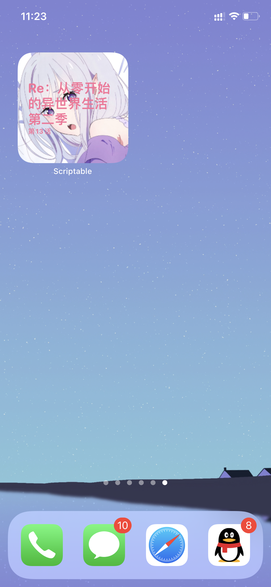

# iOS 14小组件

## 使用方法
### 安装scriptable
安装[scriptable测试版](https://testflight.apple.com/join/uN1vTqxk) 或 直接安装app store 中的[scriptable](https://apps.apple.com/cn/app/scriptable/id1405459188) .
> 这里建议安装测试版，因为测试版支持更多特性，且我的脚本一般是以测试版为基础编写的。

### 安装脚本
安装脚本有两种方法，自行选择：
方法1：在`scriptable`中新建脚本，然后将`scripts`文件夹下的js文件内容粘贴到脚本中。
方法2：使用`alook`的下载器或其它工具下载`build`文件夹中文件的`raw`链接，然后用`scriptable`打开，选择`Add to my scripts`即可。

### 使用
1. 在桌面创建小组件 选择 `scriptable`

2. 编辑 小组件，点击`选取 script` 并选择前面导入的脚本。

## bilibili 最近更新

