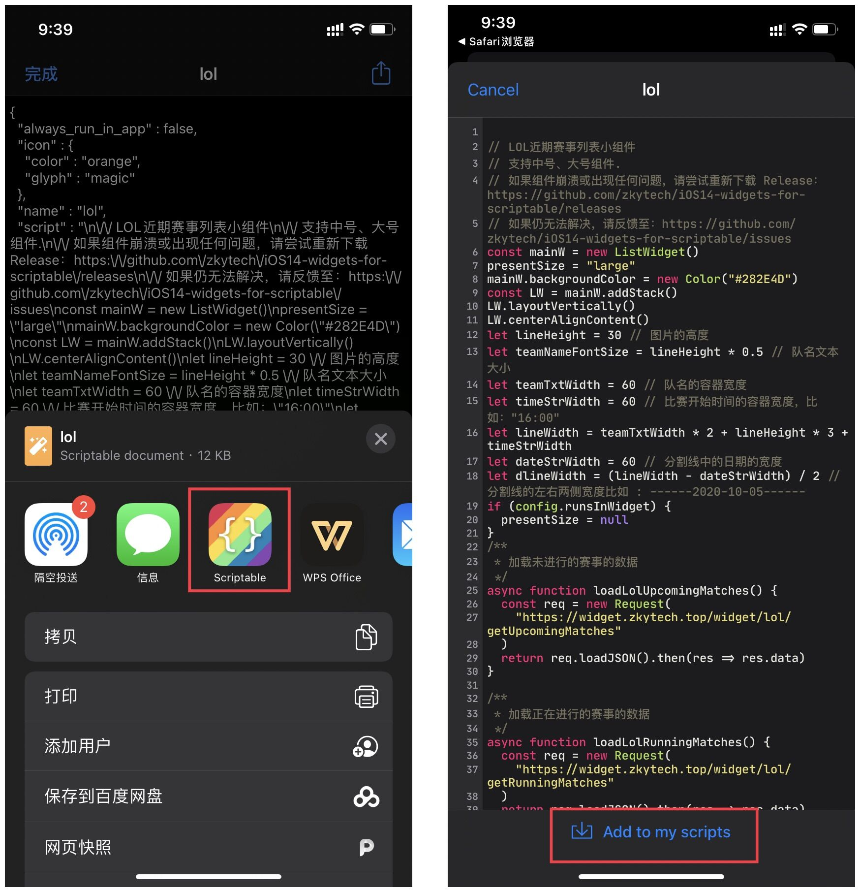
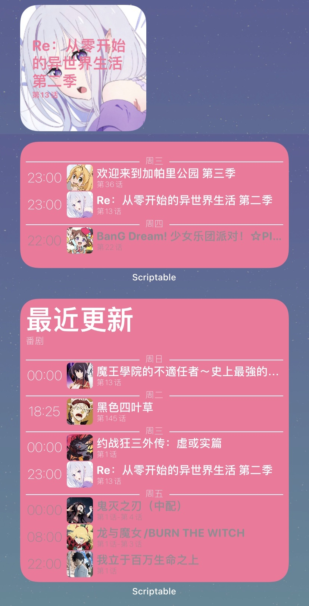
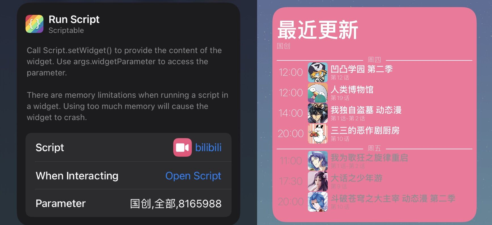
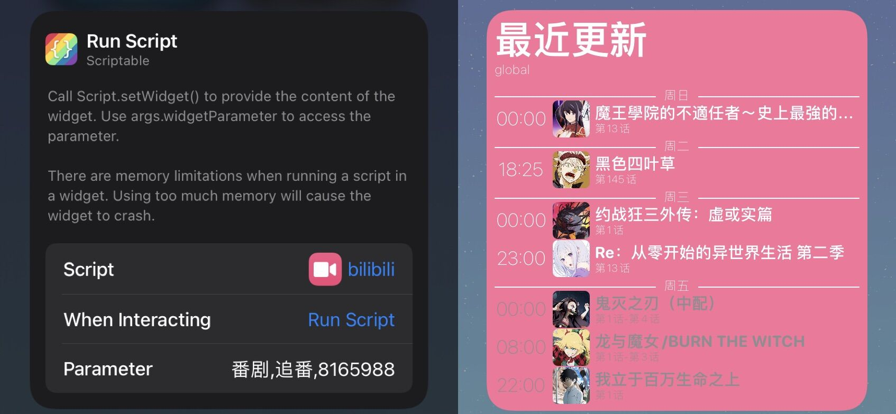

> 如果本项目对你有帮助，欢迎在[Github](https://github.com/zkytech/iOS14-widgets-for-scriptable)点个star表示支持。
> 
> 联系邮箱：zhangkunyuan@hotmail.com ，PR请提交到[Github](https://github.com/zkytech/iOS14-widgets-for-scriptable)
# iOS 14小组件
<!-- vscode-markdown-toc -->
- [iOS 14小组件](#ios-14小组件)
  - [1 使用方法](#1-使用方法)
    - [1.1 安装scriptable](#11-安装scriptable)
    - [1.2 安装脚本](#12-安装脚本)
    - [1.3 使用](#13-使用)
  - [2 bilibili最近更新番剧列表](#2-bilibili最近更新番剧列表)
    - [2.1 效果预览](#21-效果预览)
    - [2.2 安装](#22-安装)
    - [2.3 参数](#23-参数)
  - [3 LOL近期赛事列表](#3-lol近期赛事列表)
    - [3.1 效果预览](#31-效果预览)
    - [3.2 安装](#32-安装)
  - [4 深蓝SL03车辆状态](#4-深蓝sl03车辆状态)
    - [4.1 效果预览](#41-效果预览)
    - [4.2 安装](#42-安装)
    - [4.2 参数](#42-参数)

<!-- vscode-markdown-toc-config
	numbering=false
	autoSave=true
	/vscode-markdown-toc-config -->
<!-- /vscode-markdown-toc -->
## <a name='1-使用方法'></a>1 使用方法
### <a name='1.1-安装scriptable'></a>1.1 安装scriptable
安装[scriptable测试版](https://testflight.apple.com/join/uN1vTqxk) 或 直接安装app store 中的[scriptable](https://apps.apple.com/cn/app/scriptable/id1405459188) .
<!-- > 这里建议安装测试版，因为测试版支持更多特性，且我的脚本一般是以测试版为基础编写的。 -->

### <a name='1.2-安装脚本'></a>1.2 安装脚本
安装脚本有两种方法，自行选择：

方法1：在`scriptable`中新建脚本，然后将`scripts`文件夹下的js文件内容粘贴到脚本中。

方法2：在[Release页面](https://github.com/zkytech/iOS14-widgets-for-scriptable/releases)下载`.scriptable`安装脚本，然后用`scriptable`打开，选择`Add to my scripts`即可。


### <a name='1.3-使用'></a>1.3 使用
1. 在桌面创建小组件 选择 `scriptable`

2. 编辑 小组件，点击`选取 script` 并选择前面导入的脚本。


## <a name='2-bilibili最近更新番剧列表'></a>2 bilibili最近更新番剧列表

### <a name='2.1-效果预览'></a>2.1 效果预览



### <a name='2.2-安装'></a>2.2 安装

下载[安装脚本](https://cdn.jsdelivr.net/gh/zkytech/iOS14-widgets-for-scriptable@master/build/bilibili.scriptable)后，用`scriptable`打开

### <a name='2.3-参数'></a>2.3 参数

小组件的parameter可以设置以下几个值

<table>
    <thead>
        <tr>
            <th>参数</th> <th>必填</th> <th>值/示例</th> <th>说明</th> 
        </tr>
    </thead>
    <tbody>
        <tr>
            <td rowspan="3">type</td> <td rowspan="3">否</td> <td>番剧/global/进口</td> <td>进口番剧</td>
        </tr>
        <tr>
            <td>国创/cn/国产</td> <td>国产动画</td>
        </tr>
        <tr>
            <td>all/全部</td> <td>进口+国产</td>
        </tr>
        <tr>
            <td rowspan="2">onlyFollowed</td> <td rowspan = "2">否</td> <td>追番/true</td> <td>仅显示已追</td>
        </tr>
        <tr>
            <td>全部/false</td> <td>未追番 + 已追番</td>
        </tr>
        <tr>
            <td>uid</td> <td>当onlyFollowed为追番/true时 必填</td> <td>8165988</td> <td>Bilibili账号的UID，如果要设置仅显示追番，必须同时设定这个值。同时要设置空间公开显示番剧订阅</td>
        </tr>
    </tbody>
</table>

> 获取uid：B站APP - 我的 - 点击头像 - 详情

在小组件的编辑界面，按照以下格式进行配置

```javascript
// 配置格式
type,onlyFollowed,uid  //注意必须用英文逗号

// 示例
示例1: 国创,追番,8165988

示例2: cn,true,8165988

示例3: ,追番,8165988

示例4: ,true,8165988

示例5: 番剧,追番,8165988

示例6: global,true,8165988

示例7: 全部,追番,8165988

示例8: all,true,8165988
```

配置示例






## <a name='3-lol近期赛事列表'></a>3 LOL近期赛事列表

### <a name='3.1-效果预览'></a>3.1 效果预览


### <a name='3.2-安装'></a>3.2 安装

下载[安装脚本](https://cdn.jsdelivr.net/gh/zkytech/iOS14-widgets-for-scriptable@master/build/lol.scriptable)后，用`scriptable`打开

## <a name='4-深蓝sl03车辆状态'></a>4 深蓝SL03车辆状态
### <a name='4.1-效果预览'></a>4.1 效果预览
桌面组件

锁屏电量

### <a name='4.2-安装'></a>4.2 安装

1. 安装[Scriptable APP](https://apps.apple.com/cn/app/scriptable/id1405459188)
2. 下载[桌面组件安装脚本](https://gitee.com/zkytech/iOS14-widgets-for-scriptable/raw/master/build/SL03Widget.scriptable)/[锁屏组件安装脚本](https://gitee.com/zkytech/iOS14-widgets-for-scriptable/raw/master/build/SL03LockScreenWidget.scriptable)后，用`Scriptable`打开

> 增程车型的油、电续航数据可能会变成-1、0，这种情况是深蓝APP的API问题，我无法解决，请知悉。
> 车型颜色需要收集比对各种颜色车子的抓包数据来判断是哪个字段，目前没有足够的数据支撑，所以统一白色。
### <a name='4.2-参数'></a>4.2 参数

- 桌面组件参数: `refresh_token`
- 锁屏组件参数: `refresh_token`,`mode`
  - `mode`为可选值，可以填写:`电`、`油`
  - 填写实例:`asdasidjoas123jkhbh,电`。注意使用英文逗号分隔两个参数，不要填写多余的空格

本组件需要获取refresh_token，操作过程涉及抓包。抓包方法请自行百度。以桌面组件为例，使用方法如下：

1. 安装[Stream APP](https://apps.apple.com/cn/app/stream/id1312141691)，并开启**HTTPS抓包**
2. 点击`开始抓包`
3. 打开`深蓝`APP，进入控车页面，下拉刷新车辆状态。
4. 回到`Stream` APP，停止抓包
5. 进入抓包历史，查看刚刚生成的抓包记录，搜索`refresh`，可以看到URI为`/appapi/v1/member/ms/refreshCacToken`的请求
6. 点击查看请求详情，查看`响应-响应主体-查看json`
7. 将`refresh_token`的值复制下来
8. 桌面创建Scriptable中号组件，脚本选择前面安装的`SL03Widget`,将前面复制的`refresh_token`值粘贴到小组件的`parameter`中

锁屏组件使用方法与上面相同。